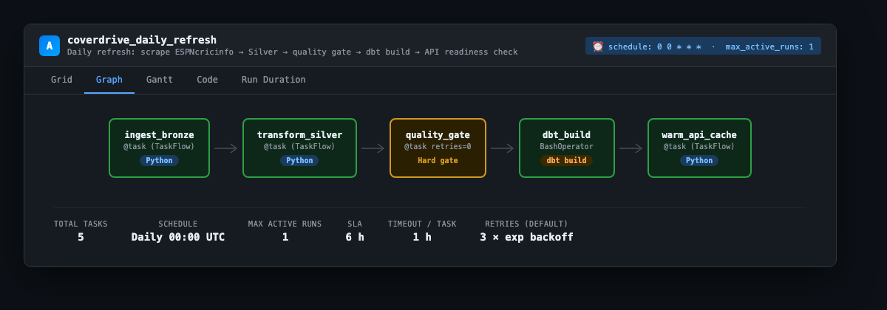
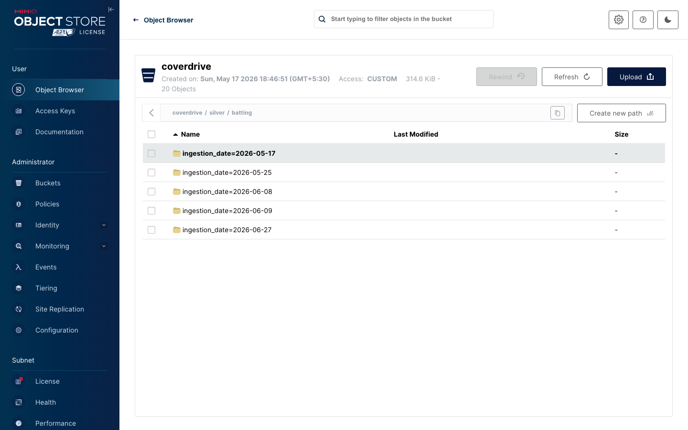
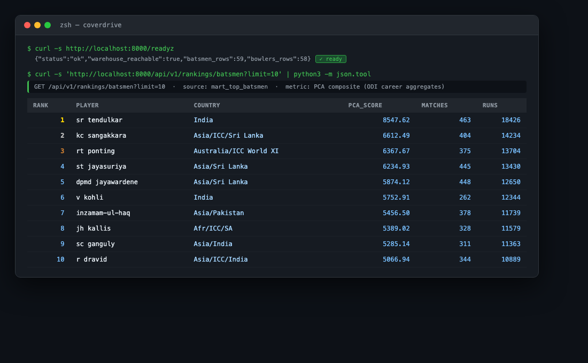
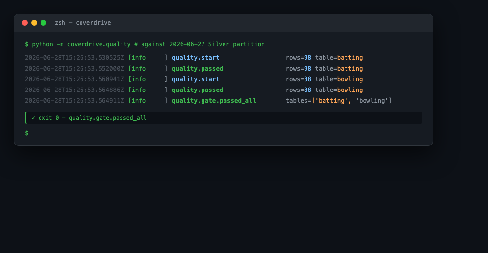
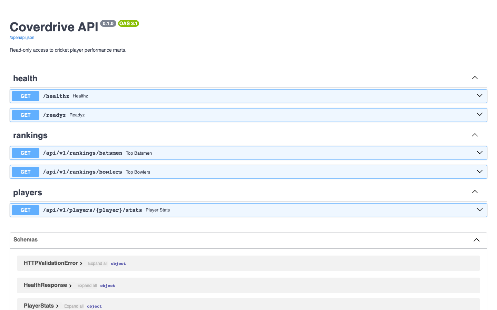
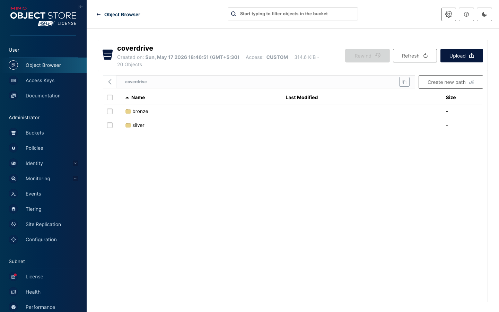
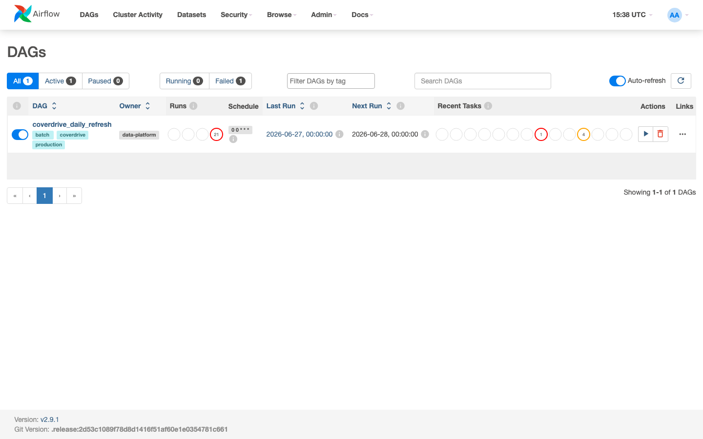
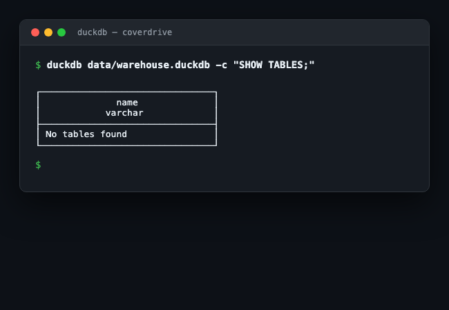

# Coverdrive — Cricket Career Analytics Platform

ODI career statistics for ~5,000 players exist on ESPNcricinfo in paginated HTML tables with no public API, no versioning, and no schema contract. Analysts who want to rank players or build derived metrics either scrape and discard the results, or rely on downstream tools with no audit trail. Coverdrive ingests that data on a daily schedule, validates it through a hard schema gate, models it in a local DuckDB warehouse using dbt, and exposes ranking endpoints via FastAPI — all reproducible from a single `make demo` command, with no cloud account required.

[](.github/workflows/ci.yml)


---

## Visual Proof of Execution

<details>
<summary><b>View Pipeline Execution & Infrastructure Proof</b></summary>
<br>









</details>

---

## Technology Stack and Architectural Decisions

### Stack

| Layer | Tool | Version |
|---|---|---|
| Language | Python | 3.11 |
| HTTP + scraping | `requests`, `beautifulsoup4`, `lxml`, `tenacity` | ≥2.31, ≥4.12, ≥5.0, ≥8.2 |
| DataFrames + serialisation | `pandas`, `pyarrow` | ≥2.2, ≥15.0 |
| Object storage | S3 / MinIO via `boto3` | ≥1.34 |
| Config + validation | `pydantic`, `pydantic-settings`, YAML | ≥2.6, ≥2.2 |
| Structured logging | `structlog` | ≥24.1 |
| Schema quality gate | `pandera` | ≥0.18 |
| Warehouse | DuckDB | ≥0.10 |
| SQL transformation | dbt (`dbt-duckdb`) | ≥1.7 |
| Serving | FastAPI + Uvicorn | ≥0.110, ≥0.27 |
| Orchestration | Apache Airflow (TaskFlow API) | 2.9.1 |
| Testing | pytest, `pytest-cov`, `moto[s3]` | ≥8.0, ≥4.1, ≥5.0 |
| Lint / format | ruff | ≥0.4 |
| Type checking | mypy (strict mode) | ≥1.9 |
| Infrastructure-as-code | Terraform, AWS provider | 1.6+, 5.x |
| CI | GitHub Actions | — |

### Architectural Decisions

**DuckDB over a managed warehouse.** DuckDB reads Parquet on S3 natively and presents the same SQL surface as Snowflake or BigQuery for what this workload requires. Switching to a managed warehouse is a single profile change in `dbt/profiles.yml`. Running locally costs nothing and avoids round-trip network latency on every dbt model materialisation during development.

**Pandera with `retries=0` on the quality gate.** The Airflow task `quality_gate` deliberately disables retries. A schema violation is not a transient failure — it signals that ESPNcricinfo's HTML structure changed or a new data anomaly appeared. Retrying the same bad data produces the same bad result. The pipeline halts and the operator investigates; bad data never reaches the Gold layer.

**Pure-function transforms decoupled from I/O.** `transform_batting` and `transform_bowling` in [`src/coverdrive/transform.py`](src/coverdrive/transform.py) are `pd.DataFrame → pd.DataFrame` mappings. The S3 reads and writes live in `read_bronze` and `write_silver`, which are separate functions. This means every transformation can be unit-tested from a CSV fixture, with no boto3 mock required. The Airflow task, the CLI entrypoint, and the test suite all call the same pure functions.

**PCA as a SQL metric, not a learned target.** The original 2022 MSc dissertation trained XGBoost to predict a PCA-derived composite score from the same statistics the PCA was computed from — textbook target leakage that produced a 99% R² with no real predictive signal. The fix is structural: PCA now lives in `dbt/macros/compute_pca.sql` as a deterministic weighted sum applied at warehouse build time. There is no model, no training, no retraining cadence. Full reasoning in [`docs/adr-pca-leakage.md`](docs/adr-pca-leakage.md).

**Hive-partitioned Parquet over a mutable database in the lakehouse.** Writing Bronze as `bronze/{table}/ingestion_date=YYYY-MM-DD/data.parquet` makes every day's raw scrape addressable and idempotent. Re-running ingestion on the same date overwrites exactly one partition; historical data is untouched. DuckDB's `read_parquet('s3://.../**/*.parquet', hive_partitioning=true)` exposes the partition key as a filter column with no additional code.

**Terraform stops at data-plane primitives.** The `infra/terraform/` module provisions S3, RDS, ECR, IAM, and CloudWatch — the things a compute layer consumes. It does not provision ECS or MWAA. This keeps local testing self-contained: the docker-compose stack is the working system, and the Terraform module is the production data-plane contract, not an environment that has to be kept in sync.

---

## Installation and Execution

### Prerequisites

- Docker + Docker Compose
- Python 3.11
- `make`
- ~2 GB free RAM

### Quickstart (fixtures, no live scrape)

```bash
git clone https://github.com/nadeem/coverdrive.git
cd coverdrive
cp .env.example .env
make demo
```

`make demo` starts MinIO, Postgres, Airflow, and the API via docker-compose. It seeds Bronze from bundled fixture CSVs (no network request to ESPNcricinfo), runs the Silver transform, Pandera quality gate, and `dbt build`. It takes roughly two minutes on first run while the Airflow image pulls.

When the command finishes:

**API docs (Swagger UI)** — `http://localhost:8000/docs`


**MinIO object console** — `http://localhost:9101` (Credentials: `minioadmin` / `minioadmin`)


**Airflow UI** — `http://localhost:8180` (Credentials: `admin` / `admin`)


**DuckDB warehouse** — `data/warehouse.duckdb` (Queryable with `duckdb` CLI)


### Try the API

```bash
# Top 10 ODI batsmen ranked by PCA composite (min 20 matches)
curl 'http://localhost:8000/api/v1/rankings/batsmen?limit=10' | jq

# Full career stats for a player
curl 'http://localhost:8000/api/v1/players/SR%20Tendulkar/stats' | jq
```

### Run against the live ESPN source

Fixtures mode is the default so CI stays deterministic and offline. To hit the real source:

```bash
unset COVERDRIVE_USE_FIXTURES
make ingest      # scrapes ESPNcricinfo with tenacity retries + exponential backoff
make transform   # Bronze → Silver
make quality     # Pandera gate
make dbt-build   # materialise warehouse models
```

### Environment variables

All variables are documented in `.env.example`. The minimum set to override for a non-default S3 backend:

```bash
COVERDRIVE_S3_BUCKET=coverdrive
COVERDRIVE_S3_ENDPOINT=http://localhost:9100
COVERDRIVE_S3_ACCESS_KEY=minioadmin
COVERDRIVE_S3_SECRET_KEY=minioadmin
COVERDRIVE_WAREHOUSE_PATH=data/warehouse.duckdb
```

### Running tests locally

```bash
python -m venv .venv && source .venv/bin/activate
pip install -e ".[dev,dbt]"
make lint        # ruff format --check + ruff check
make typecheck   # mypy strict
make test        # pytest with coverage (60% minimum enforced)
make ci          # all three + dbt parse
```

### Optional: AWS data-plane provisioning

```bash
cd infra/terraform
terraform init
terraform plan -var="environment=dev"
terraform apply -var="environment=dev"
```

This provisions S3, RDS, ECR, IAM, and CloudWatch. It does not provision ECS or MWAA.

---

## Key Technical Challenges

### ESPN HTML structure mismatch and the column-name schism

The trickiest debugging session in this project was not in the orchestration layer or the quality gate — it was in `transform_batting`, and it took two hours to find because the symptom was downstream.

During development, the fixture CSVs were exported from early scrape runs. Those scrapes called `pd.read_html` on ESPN's stats page and got column names like `Mat`, `Inns`, `Ave`, `SR`, `100`, `50` — ESPN's own abbreviated headers. The transform function was built against those names.

When the pipeline was run against the live source several weeks later, a subset of players produced `NaN` for every numeric column. Not some — every numeric column, for every player in a page range. The Pandera gate caught it (the null-ratio check fired on `runs`), which was good, but the error message said `batting: null ratio exceeds threshold 5.0% for columns: runs=100.0%` — a 100% null column, which pointed at the column existence logic, not the parsing.

The root cause was that `pd.read_html` with `flavor="lxml"` returns column names verbatim from the `<th>` cells. ESPN had silently added a hidden `<col>` group element that caused lxml to parse the table with an unnamed leading column, shifting every column index by one. The rename map in `transform_batting` never matched, so all output columns fell through to the schema-stabilisation block at the bottom of the function, which fills missing numeric columns with `pd.NA`.

The fix required three steps. First, tracing the NaN back through the rename map by inserting a `log.debug("transform.batting.columns_after_rename", columns=list(df.columns))` call and replaying a single fixture through the scraper against a saved HTML file. The log showed that every column had shifted: what should have been `player_raw` was appearing under `Unnamed: 0`, and the actual column names were offset by one position. Second, adding the Unnamed-column strip (`df.loc[:, ~df.columns.astype(str).str.startswith("Unnamed")]`) at the very top of the function, before the rename map runs — so any leading index artifact, regardless of where it came from, is dropped before name matching begins. Third, hardening the `ESPN_RESULTS_TABLE_INDEX` constant in [`src/coverdrive/ingestion.py`](src/coverdrive/ingestion.py) with a guard that raises a descriptive `ValueError` if fewer tables than expected are found, so a future ESPN structural change surfaces at parse time rather than propagating nulls silently into Bronze.

The broader lesson: when every column goes null at once, the bug is almost always in the column-existence path, not in individual cell parsing. The schema-stabilisation block that fills missing columns with typed `NA` is an intentional safety net — but it also masks the exact failure mode that caused this. The structlog call that exposes column names at the start of the transform is now part of the permanent logging config, not a debug addition.

---

## Future Roadmap

- **CricSheet ball-by-ball integration.** The flat career aggregates on ESPNcricinfo support ranking but not forecasting. A second source ingesting CricSheet's per-innings records would enable a proper next-season prediction model — the one the dissertation should have built — where features observed up to year `t` predict `runs_at_t+1`.
- **Test and T20I formats.** The current pipeline is ODI-only. The scraper configuration in `conf/pipeline.yaml` is parameterised; adding Test and T20I sources is a configuration change and a new set of dbt staging models.
- **Annual PCA loading recomputation.** The PCA loadings in `dbt/macros/compute_pca.sql` are fixed at 2022 values. An annual job that recomputes loadings against the current Silver tables, produces a diff, and gates on human review before merging would keep the metric calibrated as the player distribution changes.
- **Streaming readiness check.** The current `/readyz` endpoint only validates that the DuckDB warehouse file exists. A more useful readiness check would confirm the mart row counts match the expected partition, so the API doesn't serve stale data after a failed dbt build without reporting degraded status.
- **Expand Terraform to compute layer.** The current module stops at data-plane primitives. An ECS service definition for the API container and an MWAA environment for Airflow, with environment-specific variable injection, would close the gap between the local docker-compose stack and a production deployment.

---

## Repository Map

```
coverdrive/
├── README.md
├── Makefile                           one-command lifecycle (demo, ingest, transform, quality, dbt-build, ci)
├── Dockerfile                         API container
├── docker-compose.yml                 MinIO + Postgres + Airflow 2.9 + FastAPI
├── pyproject.toml                     ruff/mypy strict config, dependency pins
├── conf/pipeline.yaml                 every pipeline parameter, Pydantic-validated at startup
├── src/coverdrive/
│   ├── ingestion.py                   paginated ESPN scrape → Bronze Parquet on S3
│   ├── transform.py                   pure-function Bronze → Silver transformations
│   ├── quality.py                     Pandera schema gate (halts DAG on failure)
│   ├── api.py                         FastAPI, /healthz, /readyz, ranking endpoints
│   └── utils.py                       S3 client, config loader, logging setup
├── dbt/
│   ├── models/staging/                typed views over Silver
│   ├── models/marts/                  dim_player, fact_career_stats, mart_top_batsmen, mart_top_bowlers
│   └── macros/compute_pca.sql         deterministic PCA composite as SQL weighted sum
├── airflow/dags/daily_refresh.py      TaskFlow DAG — ingest → transform → quality gate → dbt → API warmup
├── tests/                             pytest + moto S3 mocks + CSV fixtures
├── infra/terraform/                   AWS S3, RDS, ECR, IAM, CloudWatch module
└── docs/
    ├── ARCHITECTURE.md                system design and component contracts
    └── adr-pca-leakage.md             postmortem: why the 2022 dissertation's 99% R² was a bug
```

---

## About

Nadeem Theba. The original version was my MSc dissertation at the University of Hertfordshire (2022). In 2026 I rebuilt it as a data engineering platform after identifying that the core ML result was an artefact of target leakage. The most useful path through this repo: the ADR, then `src/coverdrive/transform.py` and its tests, then `dbt/macros/compute_pca.sql`.

- LinkedIn: [linkedin.com/in/nadeem-theba-602862208](https://linkedin.com/in/nadeem-theba-602862208)
- Email: nadeemtheba8@gmail.com

---

## License

MIT — see [LICENSE](LICENSE).
