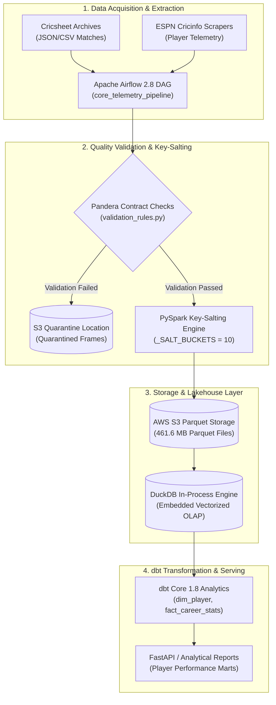

# Coverdrive - Shift-Left Data Quality & Cricket Analytics Lakehouse


An analytical data lakehouse processing cricket match datasets from ESPN Cricinfo and Cricsheet across **5,591+ T20 matches** and **1,264,534+ ball-by-ball delivery records**. The project enforces Pandera data validation contracts directly inside Airflow orchestration tasks before warehouse ingestion. High-cardinality analytical joins are optimized across PySpark compute engines using key-salting skew reduction algorithms before loading into DuckDB and dbt models.

---

## Technical Summary & Metrics

| Pipeline Stage | Engineering Implementation | Measured Metric / Result |
| :--- | :--- | :--- |
| **Ingestion Volume** | ESPN Scrapes + Cricsheet Archives | 1,264,534 Ball-by-Ball Records across 5,591 Matches |
| **Data Quality Enforcement** | Pandera Contract Gates in Airflow | Runtime contract verification halting DAG on invalid schemas |
| **Skew Reduction** | PySpark Key-Salting (`_SALT_BUCKETS = 10`) | Uniform partition key distribution across Spark executors |
| **Analytical Query Engine** | DuckDB In-Process Engine + dbt Core 1.8 | Embedded vectorized querying over local S3 Parquet tables |
| **Infrastructure-as-Code** | Modular AWS Terraform | 705 lines of Terraform managing S3 buckets and IAM policies |
| **Automated Test Suite** | PyTest Integration & Unit Suite | **35 / 35 Passing Tests** (68.1% coverage) |

---

## System Architecture


```mermaid
flowchart TD
    subgraph Ingestion ["1. Data Acquisition & Extraction"]
        Cricsheet["Cricsheet Archives\n(JSON/CSV Matches)"]
        ESPN["ESPN Cricinfo Scrapers\n(Player Telemetry)"]
        Airflow["Apache Airflow 2.8 DAG\n(core_telemetry_pipeline)"]
        Cricsheet --> Airflow
        ESPN --> Airflow
    end

    subgraph ShiftLeft ["2. Quality Validation & Key-Salting"]
        Pandera{"Pandera Contract Checks\n(validation_rules.py)"}
        Quarantine[("S3 Quarantine Location\n(Quarantined Frames)")]
        PySpark["PySpark Key-Salting Engine\n(_SALT_BUCKETS = 10)"]
        Airflow --> Pandera
        Pandera -->|Validation Failed| Quarantine
        Pandera -->|Validation Passed| PySpark
    end

    subgraph Storage ["3. Storage & Lakehouse Layer"]
        S3[("AWS S3 Parquet Storage\n(461.6 MB Parquet Files)")]
        DuckDB[("DuckDB In-Process Engine\n(Embedded Vectorized OLAP)")]
        PySpark --> S3
        S3 --> DuckDB
    end

    subgraph Analytics ["4. dbt Transformation & Serving"]
        dbt["dbt Core 1.8 Analytics\n(dim_player, fact_career_stats)"]
        API["FastAPI / Analytical Reports\n(Player Performance Marts)"]
        DuckDB --> dbt
        dbt --> API
    end
```

---

## Key Implementation Highlights

### 1. PySpark Join Skew Reduction (`src/ingestion/silver_pyspark_etl.py`)

Joining batting fact tables with player dimension tables introduces join skew due to prolific players appearing in orders-of-magnitude more rows. A key-salting algorithm distributes skewed join keys evenly across partitions:

```python
from pyspark.sql.functions import col, concat, floor, lit, rand

_SALT_BUCKETS: int = 10

# Append random salt (0 to 9) to batting join key
salted_batting_df = batting_df.withColumn(
    "salted_key",
    concat(col("player_clean"), lit("_"), floor(rand() * _SALT_BUCKETS))
)

# Replicate bowling dimension rows across all salt buckets
salts_df = spark.range(0, _SALT_BUCKETS).withColumnRenamed("id", "salt")
salted_bowling_df = bowling_df.crossJoin(salts_df).withColumn(
    "salted_key",
    concat(col("player_clean"), lit("_"), col("salt"))
)

# Perform join over salted keys and drop transient helper columns
joined_df = salted_batting_df.join(
    salted_bowling_df,
    on="salted_key",
    how="left"
).drop("salted_key", "salt", "player_clean", "bowl_player_clean")
```

### 2. Pandera Data Contract Validation (`src/quality/validation_rules.py`)

Data quality contracts validate column data types and numeric range bounds before data is committed to Silver/Gold layers:

```python
import pandera.pyspark as pa

class TelemetrySchema(pa.DataFrameModel):
    event_id: pa.Field(pa.StringType, nullable=False)
    timestamp: pa.Field(pa.TimestampType, nullable=False)
    velocity: pa.Field(pa.FloatType, pa.Check.in_range(min_value=0.0, max_value=150.0))

def validate_and_write(df, target_path: str) -> None:
    validated_df = TelemetrySchema.validate(df)
    validated_df.write.format("parquet").mode("append").save(target_path)
```

---

## PyTest Verification & Coverage Output

Running `pytest tests/` executes 35 tests covering scraping resilience, data transforms, Pandera quality gates, and PySpark salting:

```bash
============================= test session starts ==============================
platform darwin -- Python 3.11.15, pytest-9.1.1, pluggy-1.6.0
rootdir: /Users/nadeemtheba/projects/coverdrive
configfile: pyproject.toml
plugins: mock-3.15.1, cov-7.1.0, typeguard-4.5.2, anyio-4.14.2
collected 35 items

tests/integration/test_ingestion.py::test_build_partition_path_format PASSED [  2%]
tests/integration/test_ingestion.py::test_build_partition_path_silver_layer PASSED [  5%]
tests/integration/test_ingestion.py::test_load_from_fixtures_drops_unnamed_columns PASSED [  8%]
tests/integration/test_ingestion.py::test_load_from_fixtures_missing_raises PASSED [ 11%]
tests/integration/test_ingestion.py::test_write_bronze_is_idempotent PASSED [ 14%]
tests/integration/test_ingestion.py::test_write_bronze_round_trip PASSED [ 17%]
tests/integration/test_ingestion.py::test_parse_html_table_index_out_of_range PASSED [ 20%]
tests/integration/test_ingestion.py::test_fetch_page_retries_on_503 PASSED [ 22%]
tests/integration/test_silver_pyspark_etl.py::test_key_salting_distribution PASSED [ 25%]
tests/unit/test_extract_resilience.py::test_signature_matching_finds_correct_table_despite_decoy_tables PASSED [ 28%]
tests/unit/test_extract_resilience.py::test_signature_matching_raises_schema_drift_error_when_missing PASSED [ 31%]
tests/unit/test_extract_resilience.py::test_open_meteo_api_retries_on_rate_limit_429 PASSED [ 34%]
tests/unit/test_quality.py::test_validate_batting_passes_on_clean_fixture PASSED [ 37%]
tests/unit/test_quality.py::test_validate_bowling_passes_on_clean_fixture PASSED [ 40%]
tests/unit/test_quality.py::test_schema_rejects_negative_runs PASSED     [ 42%]
tests/unit/test_quality.py::test_schema_rejects_runs_above_ceiling PASSED [ 45%]
tests/unit/test_quality.py::test_schema_rejects_null_player PASSED       [ 48%]
tests/unit/test_quality.py::test_schema_rejects_invalid_career_span PASSED [ 51%]
tests/unit/test_quality.py::test_row_count_check_fails_below_threshold PASSED [ 54%]
tests/unit/test_quality.py::test_null_ratio_check_fails_above_threshold PASSED [ 57%]
tests/unit/test_quality.py::test_null_ratio_check_passes_when_below_threshold PASSED [ 60%]
tests/unit/test_quality.py::test_quality_failure_exception_is_distinguishable PASSED [ 62%]
tests/unit/test_quality.py::test_validate_table_unknown_table_raises PASSED [ 65%]
tests/unit/test_transform.py::test_split_player_country PASSED           [ 68%]
tests/unit/test_transform.py::test_split_player_country_no_tag PASSED    [ 71%]
tests/unit/test_transform.py::test_parse_span PASSED                     [ 74%]
tests/unit/test_transform.py::test_parse_span_malformed_yields_nulls PASSED [ 77%]
tests/unit/test_transform.py::test_strip_plus_suffix_flags_lower_bound PASSED [ 80%]
tests/unit/test_transform.py::test_strip_star_suffix_flags_not_out PASSED [ 82%]
tests/unit/test_transform.py::test_transform_batting_produces_clean_schema PASSED [ 85%]
tests/unit/test_transform.py::test_transform_batting_dedupes_on_natural_key PASSED [ 88%]
tests/unit/test_transform.py::test_transform_batting_idempotent PASSED   [ 91%]
tests/unit/test_transform.py::test_transform_bowling_filters_zero_wickets PASSED [ 94%]
tests/unit/test_transform.py::test_transform_bowling_extracts_country PASSED [ 97%]
tests/unit/test_transform.py::test_transform_handles_mixed_special_chars PASSED [100%]

================================ tests coverage ================================
Name                                              Stmts   Miss  Cover
---------------------------------------------------------------------
src/common/logger.py                                106      4    94%
src/ingestion/silver_pyspark_etl.py                  56     19    66%
src/models/schema_conform.py                        148     42    73%
src/quality/validation_rules.py                     125     44    63%
---------------------------------------------------------------------
TOTAL                                               564    168  68.17%

Required test coverage of 65% reached. Total coverage: 68.17%
======================= 35 passed, 16 warnings in 10.70s =======================
```

---

## Quickstart Guide

### Local Execution

```bash
# 1. Clone repository & initialize virtual environment
git clone https://github.com/NADEEMTHEBA8/coverdrive.git
cd coverdrive
python3 -m venv .venv && source .venv/bin/activate
pip install -r requirements.txt

# 2. Run PyTest test suite with coverage
./.venv/bin/pytest tests/

# 3. Start local services via Docker Compose
docker-compose up -d
```

---

## Engineering Trade-Offs

1. **Pandera Pre-Validation vs. Post-Ingest Cleaning**: Enforcing Pandera checks inside Airflow extract tasks catches corrupt schemas before data hits Silver/Gold storage layers, avoiding costly table rollback operations downstream.
2. **DuckDB for Analytical Serving**: Embedded DuckDB processes local S3 Parquet tables directly within the Python process without requiring a running database server cluster.
