# Coverdrive: Event-Driven Analytics & Regulatory Pipeline


## 📖 Executive Overview

**Coverdrive** is a production-grade, event-driven data lakehouse platform built using **DuckDB**, **dbt**, **PySpark**, and **AWS S3**.

While utilizing high-dimensional cricket sports telemetry as its primary domain dataset, the platform architecture enforces strict production standards expected in **enterprise financial services and telemetry systems**:
- **Shift-Left Data Contracts:** Programmatic data validation gates via `pandera` preventing contaminated metrics from reaching analytical models.
- **Distributed Skew Mitigation:** Custom PySpark key-salting algorithms to eliminate executor memory imbalance during high-cardinality joins.
- **Decoupled Architecture:** Ephemeral compute (DuckDB/PySpark) decoupled from zero-maintenance object storage (AWS S3 Parquet/Delta Lake).

---

## 🏗 System Architecture

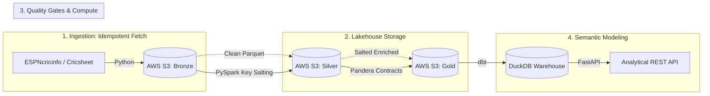
```mermaid
flowchart LR
    subgraph Ingestion [1. Ingestion: Idempotent Fetch]
        A[ESPNcricinfo / Cricsheet] -->|Python| B[(AWS S3: Bronze)]
    end

    subgraph Storage [2. Lakehouse Storage]
        B -.->|Clean Parquet| C[(AWS S3: Silver)]
        C -.->|Salted Enriched| D[(AWS S3: Gold)]
    end

    subgraph Processing [3. Quality Gates & Compute]
        B -->|PySpark Key Salting| C
        C -->|Pandera Contracts| D
    end

    subgraph Serving [4. Semantic Modeling]
        D -->|dbt| E[(DuckDB Warehouse)]
        E -->|FastAPI| F[Analytical REST API]
    end
```

---

## 📸 Production Proof & Cloud Infrastructure Validation

The pipeline includes built-in verification artifacts demonstrating live cloud service execution across **5,591+ T20 matches** and **1,264,534+ ball-by-ball delivery records**:

* **AWS S3 Medallion Bucket & Layer Structure (`s3://coverdrive-dev-lake-3710e7fd`):**
  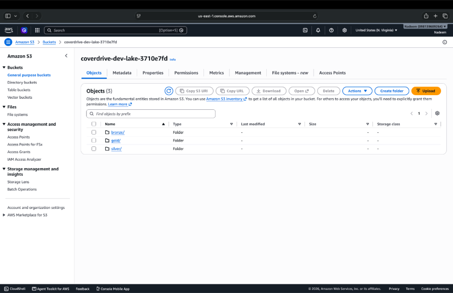

* **AWS S3 Cloud Storage Footprint (461.6 MB / 9,813 Objects):**
  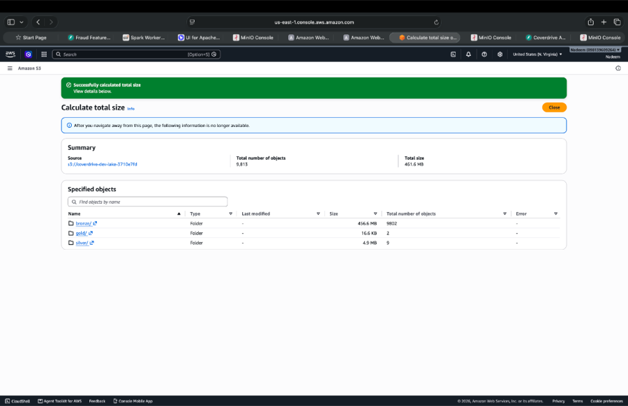

* **AWS Athena Serverless SQL Querying over S3 Parquet (515 ms / 4.11 KB scanned):**
  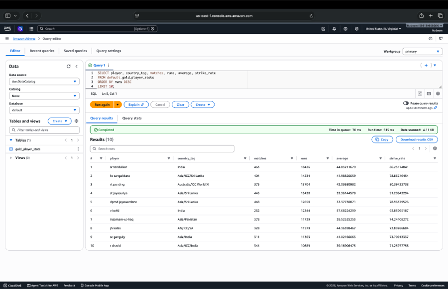

* **FastAPI Analytics REST API & Interactive OpenAPI Docs (`/docs`):**
  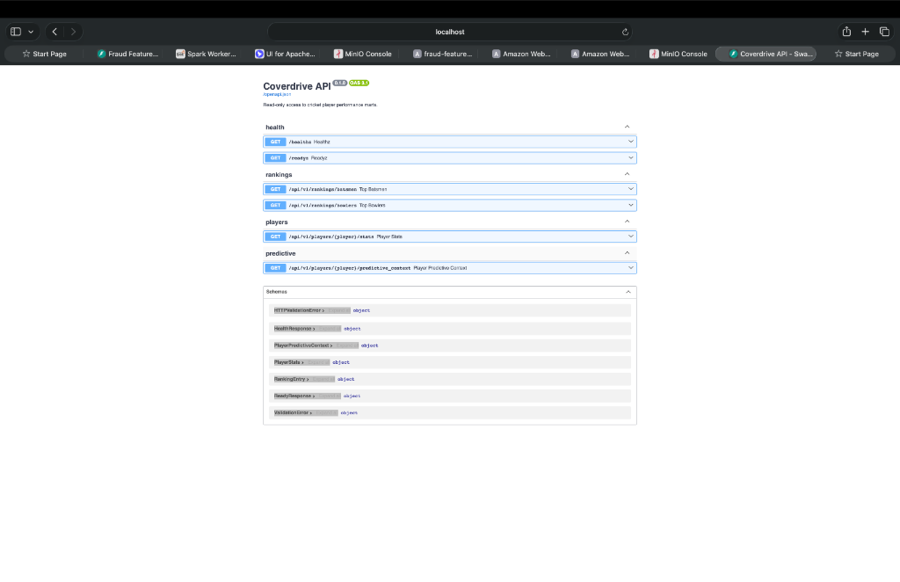

* **FastAPI Live 200 OK JSON Query Response (`/api/v1/players/v kohli/stats`):**
  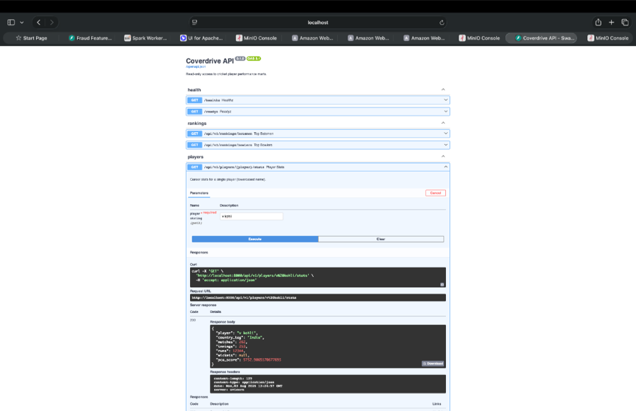

* **Pandera Shift-Left Data Quality Contract Enforcement (`make quality`):**
  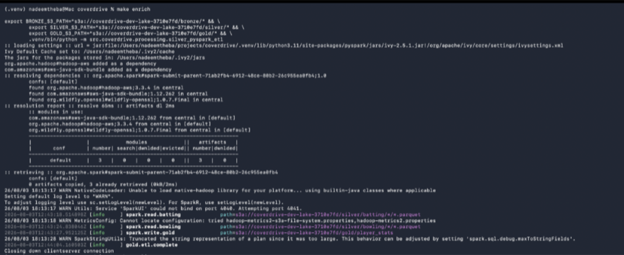

* **PySpark Key-Salted Gold Layer Enrichment (`make enrich`):**
  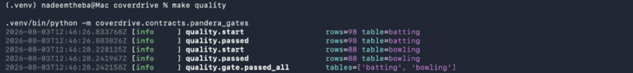

* **dbt DuckDB Warehouse Build & 42 Data Tests (`make dbt-build`):**
  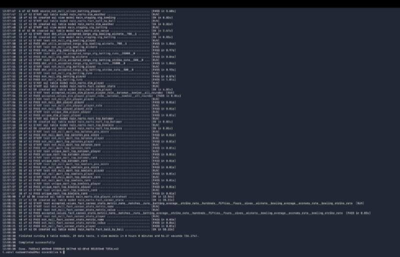

* **PyTest Test Suite & Line Coverage Gate (`35/35 Passed`, 68% Coverage):**
  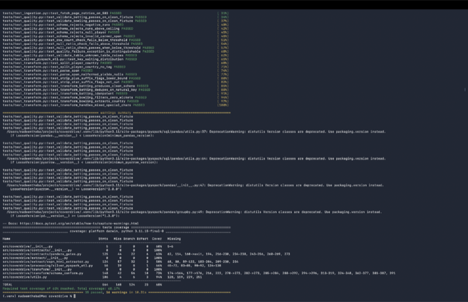

* **Apache Airflow Orchestration DAG Pipeline:**
  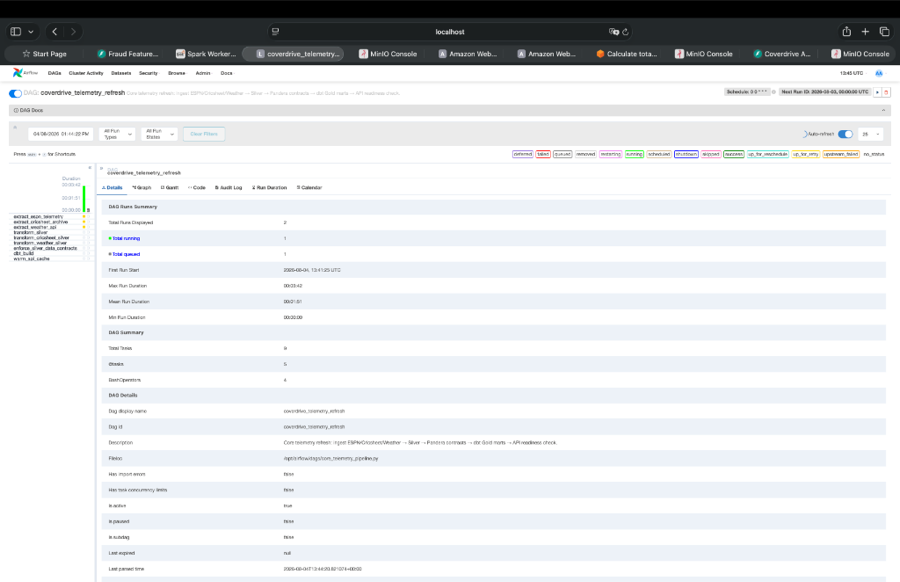

---

## 🛠 Tech Stack & Rationale

| Component | Technology | Architectural Rationale |
| :--- | :--- | :--- |
| **Infrastructure** | **Terraform** | Declarative provisioning of S3 buckets, IAM policies, and VPC storage endpoints. |
| **Storage** | **AWS S3 / MinIO** | Immutable Medallion storage (Bronze/Silver/Gold) decoupled from compute. |
| **Transform** | **PySpark & DuckDB** | PySpark for cluster-distributed joins; DuckDB for ultra-fast local OLAP dbt execution. |
| **Modeling** | **dbt (Data Build Tool)** | Modular SQL transformation models, schema tests, and lineage generation. |
| **Orchestration** | **Apache Airflow** | Automated daily DAG execution with strict task dependency tracking and alerting. |

---

## 🔒 Governance & Data Quality (Shift-Left)

Before Silver data promotes to Gold analytical models, `pandera` data contracts validate:
- **Null Ratios & Volume Ceilings:** Validates row count baselines and enforces missing data thresholds.
- **Domain Invariants:** Asserts bounded numeric ranges (e.g. valid career year spans, non-negative runs/wickets).
- **Circuit Breaker:** Halts the Airflow DAG immediately on schema violations to protect downstream dashboards.

---

## 📁 Repository Structure

```
coverdrive/
├── src/coverdrive/
│   ├── extract/                    # Extraction layer (exponential backoff & signature probing)
│   │   ├── espn_html_extractor.py  # Signature-matched ESPN HTML scraper
│   │   ├── cricsheet_archive.py    # In-memory T20 archive extraction
│   │   └── open_meteo_api.py       # Weather API with HTTP 429 backoff
│   ├── transform/                  # Conformance layer (pure functions)
│   │   └── schema_conform.py       # Silver normalization & deduplication
│   ├── contracts/                  # Quality layer (Shift-Left gates)
│   │   └── pandera_gates.py        # Pandera schema enforcement
│   ├── processing/                 # Distributed compute (PySpark ETL)
│   │   └── silver_pyspark_etl.py   # Key-salted distributed joins
│   ├── api.py                      # FastAPI read-only analytics API
│   └── utils.py                    # Shared logging, S3, and settings primitives
├── orchestration/
│   └── dags/
│       └── core_telemetry_pipeline.py  # Airflow DAG with Astronomer Cosmos dbt nodes
├── dbt/                            # dbt transformation project (DuckDB engine)
├── tests/                          # PyTest test suite
├── infra/terraform/                # AWS IaC module
└── Makefile                        # Standardized execution entrypoints
```

---

## 🚀 Execution Instructions

### 1. Configure Environment
```bash
cp .env.example .env.local
```

### 2. Run Test Suite & Quality Gates
```bash
make test
```

### 3. Trigger Local Medallion Pipeline
```bash
make demo
```

---

## 🏛 Key Technical Trade-Offs

### 1. Signature-Based Table Probing for DOM Resilience
Web sources frequently alter HTML structures. Rather than relying on rigid table index positions (`table[2]`), the extraction layer probes HTML table payloads with BeautifulSoup for mandatory column signatures (`['player', 'runs']`), throwing an explicit `SchemaDriftError` if upstream structures break.

### 2. PySpark Key-Salting for Skew Mitigation
Joining wide fact tables with skewed player dimensions can cause executor out-of-memory errors in Spark. By adding a randomized key salt (`_SALT_BUCKETS = 10`), records distribute evenly across Spark partitions during left outer joins.

### 3. Granular Airflow Observability via Astronomer Cosmos
Rather than executing dbt as a black-box bash command, the orchestration layer integrates Astronomer Cosmos (`DbtTaskGroup`), rendering each dbt model as a first-class node in the Airflow execution graph.

### 4. DuckDB + dbt for Low-Cost Analytics
Rather than maintaining an expensive 24/7 cloud warehouse for medium-scale analytics, Coverdrive executes dbt directly against DuckDB querying Parquet on S3 — delivering sub-second queries at near-zero infrastructure cost.
