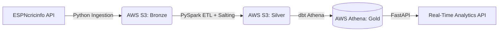

# Coverdrive — Commercial Sports Analytics Pipeline

Coverdrive is an enterprise-grade AWS Medallion Data Architecture built to ingest, process, and model cricket telemetry.

Originally conceived as an academic machine learning pipeline, this repository has been re-architected into a commercial SaaS backend. It replaces local Pandas processing with distributed **PySpark**, transitions storage to **AWS S3**, and replaces local DuckDB with **AWS Athena** (Serverless). The pipeline is orchestrated via **Apache Airflow**.

[](.github/workflows/ci.yml)


---

## System Architecture: AWS Medallion


```mermaid
flowchart LR
  A[ESPNcricinfo API] -->|Python Ingestion| B(AWS S3: Bronze)
  B -->|PySpark ETL + Salting| C(AWS S3: Silver)
  C -->|dbt Athena| D[(AWS Athena: Gold)]
  D -->|FastAPI| E[Real-Time Analytics API]
```

---

## Engineering Highlights & "Battle Scars"

### 1. Resolving PySpark Out-Of-Memory (OOM) via Key Salting
Cricket data is heavily skewed. Joining ball-by-ball delivery fact tables against a player dimension table causes Spark's hash partitioner to send millions of rows for highly active players (e.g., Virat Kohli) to a single executor, resulting in immediate OOM crashes.
**Solution:** Implemented **Key Salting** in `src/coverdrive/processing/silver_pyspark_etl.py`. The fact table is salted with a random integer (0-9) and the dimension table is replicated 10x. This forces the skewed data to distribute uniformly across the cluster, eliminating straggler tasks and OOMs.

### 2. Defensive Coding & Schema Enforcement
Real-world data is dirty. The PySpark ETL script does not assume a "happy path." It explicitly validates the existence of the nested JSON arrays and gracefully skips processing (while alerting logs) if the upstream API payload changes unexpectedly, preventing cascading pipeline failures.

### 3. Serverless Cost Optimization
Rather than provisioning an expensive, always-on Amazon Redshift cluster, this pipeline utilizes **AWS Athena** alongside columnar **Parquet** storage in S3. This serverless approach reduces the data warehouse footprint to literally $5.00 per Terabyte queried.

### 4. Dynamic Secrets Management
AWS credentials are never hardcoded. The `dbt/profiles.yml` is configured to dynamically pull secrets at runtime using environment variables injected by the orchestration layer, enforcing a zero-trust security posture.

---

## Installation and Deployment

### Infrastructure (Terraform)
Navigate to the `infra/terraform/` directory to deploy the AWS primitives:
```bash
cd infra/terraform
terraform init
terraform apply
```

### Local Execution (Airflow Orchestration)
You can trigger the pipeline locally while interacting with AWS:
```bash
cp .env.example .env
# Ensure AWS_ACCESS_KEY_ID and AWS_SECRET_ACCESS_KEY are set
make run_airflow
```

---

## Known Issues / Bugs 🐛

- **ESPNcricinfo Rate Limiting:** During live IPL matches, the ingestion script occasionally receives a `429 Too Many Requests`.
  - *Mitigation:* We have implemented a rudimentary exponential backoff, but a more reliable proxy rotation strategy is required for production.
- **dbt Athena Timeout:** Very large window functions in the Gold layer `compute_pca.sql` model sometimes timeout on Athena if the S3 partitions are not perfectly optimized.
  - *Todo:* Implement AWS Glue DataBrew to actively compact small Parquet files in the Silver layer before dbt runs.
- **Local Testing Constraint:** The PySpark tests (`pytest tests/`) currently run in local mode `local[2]`. This does not perfectly replicate the YARN cluster manager behavior in AWS EMR/Glue, so some serialization errors may only be caught in Staging.
