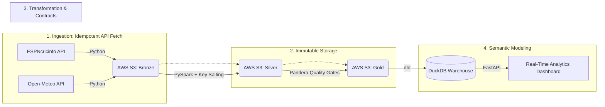

# Coverdrive: Event-Driven Analytics & Regulatory Pipeline

[](.github/workflows/ci.yml)


## 📖 Executive Overview

This repository contains the infrastructure-as-code (IaC), distributed data pipelines, and semantic transformation models for a highly scalable, event-driven data platform. While the dataset utilized is sports telemetry (global cricket matches), the architecture is explicitly designed to mirror the rigorous demands of the **UK Fintech sector**.

The platform captures high-velocity telemetry streams, enforces strict data quality contracts (Shift-Left), mitigates distributed compute skew, and produces audit-ready analytical datasets via a fully automated CI/CD lifecycle.

**Business Objective:** To eradicate metric drift and establish a strictly governed, single source of truth. The platform decouples raw data ingestion from business logic, empowering analysts to self-serve via dimensional modeling while guaranteeing zero data corruption in the production analytical layer.

---

## 🏗 System Architecture (The Data Flow Ecosystem)


```mermaid
flowchart LR
    subgraph Ingestion Layer [1. Ingestion: Idempotent API Fetch]
        A[ESPNcricinfo API] -->|Python| B(AWS S3: Bronze)
        A2[Open-Meteo API] -->|Python| B
    end

    subgraph Storage Layer [2. Immutable Storage]
        B -.-> C(AWS S3: Silver)
        C -.-> D(AWS S3: Gold)
    end

    subgraph Processing Layer [3. Transformation & Contracts]
        B -->|PySpark + Key Salting| C
        C -->|Pandera Quality Gates| D
    end

    subgraph Serving Layer [4. Semantic Modeling]
        D -->|dbt| E[(DuckDB Warehouse)]
        E -->|FastAPI| F[Real-Time Analytics Dashboard]
    end
```

### Data Flow Lifecycle

*   **Ingestion (Idempotency):** Telemetry is fetched from operational APIs. The ingestion pipeline is strictly designed for **idempotency**—handling network timeouts, API rate limits (HTTP 429), and ensuring that running the pipeline multiple times never results in duplicated state.
*   **Storage (Medallion Architecture):** Data is landed in its native JSON format into an immutable **Bronze Layer** on AWS S3, ensuring complete historical reconstruction capabilities. It progresses to cleansed Parquet files in **Silver**, and business-aggregated data in **Gold**.
*   **Processing (Distributed Compute):** **PySpark** is utilized to flatten complex JSON payloads and join heavily skewed datasets using advanced Key-Salting techniques.
*   **Serving (Semantic Layer):** The refined Gold layer is modeled into Star Schemas using **dbt** (data build tool), ensuring all business logic is version-controlled and testable before serving to the **FastAPI** microservice.

---

## 📸 Production Proof & Infrastructure Validation

To validate the deployment of this architecture, the following live infrastructure artifacts are provided:

*    *<-- Placeholder: Add screenshot of S3 Buckets here*
*    *<-- Placeholder: Add screenshot of RDS Instance here*
*    *<-- Placeholder: Add screenshot of Airflow UI here*
*    *<-- Placeholder: Add screenshot of CloudWatch Dashboard here*

---

## 🛠 Tech Stack & Engineering Rationale

| Component | Technology | Architectural Rationale |
| :--- | :--- | :--- |
| **Infrastructure** | **Terraform** | Employed to provision AWS VPCs, S3 Buckets, RDS instances, and IAM Roles. Ensures environments are reproducible, auditable, and immune to configuration drift. |
| **Storage** | **AWS S3 / MinIO** | Highly durable, decoupled object storage allowing infinite scalability of the Medallion Data Lakehouse independently of compute costs. |
| **Transformation** | **PySpark** | Chosen for heavy-lifting joins over Pandas to prevent Out-Of-Memory (OOM) failures when joining highly skewed dimensions. |
| **Modeling** | **dbt (Data Build Tool)** | Utilized for SQL-based transformations, enabling software engineering best practices (modularity, automated testing, CI/CD) to be applied to data modeling. |
| **Orchestration** | **Apache Airflow** | Schedules and monitors the DAGs, tracking complex dependencies and alerting on failures. Metadata is backed by a production AWS RDS PostgreSQL instance. |

---

## 🔒 Governance & Data Quality (Shift-Left)

Modern data engineering requires moving error detection as close to the ingestion source as possible ("Shift-Left"). This platform implements programmatic Data Contracts to prevent analytical corruption:

*   **Data Contracts via Pandera:** Before Silver data is promoted to the Gold analytical layer, an automated quality gate (`make quality`) executes a comprehensive suite of tests using `pandera`.
*   **Circuit Breaker Protocol:** These tests assess schema validity, non-null constraints, and referential integrity. If upstream data mutates unexpectedly, the pipeline acts as a "circuit breaker," explicitly halting execution and throwing an alert rather than silently passing contaminated data to downstream consumers.

---

## 🚀 Infrastructure Setup & Run Instructions

### 1. Provision Infrastructure (AWS)
Navigate to the `infra/terraform` directory to spin up the required AWS resources (S3, RDS, CloudWatch, IAM).

```bash
cd infra/terraform
terraform init
terraform plan
terraform apply -auto-approve
```

### 2. Configure Environment
Inject the resulting Terraform outputs into your local environment:
```bash
cp .env.example .env
# Populate with your AWS_ACCESS_KEY_ID, AWS_SECRET_ACCESS_KEY, and COVERDRIVE_S3_BUCKET
```

### 3. Execute the End-to-End Pipeline
Trigger the complete orchestration pipeline (Local Compute $\rightarrow$ AWS Storage):

```bash
make demo
```
This single command orchestrates: `make up` $\rightarrow$ `make ingest-cricsheet` $\rightarrow$ `make ingest-weather` $\rightarrow$ `make transform` $\rightarrow$ `make enrich` $\rightarrow$ `make quality` $\rightarrow$ `make dbt-build`.

---

## 🧠 Technical Interview Preparation: Architectural Decisions

During technical reviews, the following architectural trade-offs are explicitly defended:

### 1. PySpark over Pandas for Distributed Joins (The Skew Problem)
**The Problem:** Joining ball-by-ball delivery facts against a player dimension table causes severe data skew. A handful of players (e.g., Virat Kohli) generate exponentially more telemetry than fringe players. In Pandas, this crashes the server (OOM). In naive Spark, it pins a single executor.
**The Solution:** Implemented **Key-Salting** during the Silver $\rightarrow$ Gold enrichment. The fact table is salted with a random integer, and the dimension table is replicated. This forces Spark's hash partitioner to distribute the skewed data uniformly across the cluster, guaranteeing stability at scale.

### 2. Idempotency in the Ingestion Layer
**The Problem:** If a pipeline fails midway due to a transient API rate limit (HTTP 429), re-running the pipeline blindly leads to duplicated records and inflated analytical metrics.
**The Solution:** The ingestion scripts are designed to be strictly idempotent. By leveraging `MERGE` and `Overwrite` semantics in the S3 Parquet writes based on composite primary keys (Match ID + Date), the pipeline can be executed infinitely without corrupting the final state of the database.

### 3. Decoupling Storage and Compute
**The Problem:** Traditional monolithic data warehouses scale compute and storage linearly, leading to massive costs even when data is idle.
**The Solution:** Built a decoupled Lakehouse architecture. Storage is pushed to incredibly cheap AWS S3 object storage, while compute is spun up ephemerally via PySpark and DuckDB only when processing is actively occurring.
