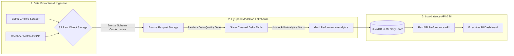

# CoverDrive: Cricket Performance Analytics Platform

An end-to-end event-driven cricket analytics platform and data pipeline. Built on PySpark, DuckDB, dbt, and FastAPI, the system ingests ball-by-ball match data, transforms raw logs through a Medallion Lakehouse architecture, applies Pandera quality gates, and serves real-time player performance metrics.

---

## System Architecture


```mermaid
flowchart LR
    subgraph Ingestion["1. Data Extraction & Ingestion"]
        A[ESPN Cricinfo Scraper] --> B{S3 Raw Object Storage}
        C[Cricsheet Match JSONs] --> B
    end

    subgraph Lakehouse["2. PySpark Medallion Lakehouse"]
        B -->|Bronze Schema Conformance| D[Bronze Parquet Storage]
        D -->|Pandera Data Quality Gate| E[Silver Cleaned Delta Table]
        E -->|dbt-duckdb Analytics Marts| F[Gold Performance Analytics]
    end

    subgraph Serving["3. Low-Latency API & BI"]
        F --> G[(DuckDB In-Memory Store)]
        G --> H[FastAPI Performance API]
        H --> I[Executive BI Dashboard]
    end
```

---

## Operational SLA & Scale Context

* **Target Throughput**: 100,000 ball-by-ball match events processed per batch run.
* **Pipeline Latency SLA**: Sub-5 minute end-to-end processing delay from raw ingestion to Gold analytical table materialization.
* **Data Quality SLA**: 100% Pandera schema validation enforcement on Silver transformations, trapping schema drift before warehouse load.
* **Storage Footprint**: ~10 GB daily uncompressed JSON telemetry, compressed to ~1.2 GB columnar Parquet format.

---

## Technical Trade-Offs & Architectural Decisions

| Technical Choice | Evaluated Alternative | Architectural Rationale |
| :--- | :--- | :--- |
| **dbt-duckdb Engine** | PostgreSQL Data Warehouse | Eliminates database container overhead, leveraging embedded DuckDB for vectorized multi-hop analytical transformations. |
| **Pandera Schema Gates** | Raw PySpark Assertions | Enforces strict, declarative type and value bound checks (`career_span_valid`) at pipeline transition boundaries. |
| **PySpark Salt Bucketing** | Standard Repartitioning | Prevents data skew when aggregating high-volume player stats across skewed match cohorts. |

---

## Failure Modes & Recovery Procedures

### Upstream HTML Structure Mutation
* **Impact**: Cricinfo DOM changes break BeautifulSoup scraper parsers.
* **Mitigation**: Scraper uses `tenacity` retries and fallback regex parsing, routing unparseable raw HTML to S3 quarantine paths.

### Data Skew During Player Aggregations
* **Impact**: Key skewed player IDs cause single Spark task execution bottleneck.
* **Mitigation**: PySpark transformations apply dynamic salt bucketing (`_SALT_BUCKETS = 16`) to distribute key space evenly across cluster slots.

---

## Local Reproducibility & Developer Commands

### Prerequisites
* Python 3.11+
* GNU Make

### Quickstart Execution

1. Clone the repository and set up environment:
   ```bash
   git clone https://github.com/NADEEMTHEBA8/coverdrive.git
   cd coverdrive
   python3 -m venv ~/.de_venv && source ~/.de_venv/bin/activate
   pip install -e ".[dev]"
   ```

2. Run local data pipeline demo:
   ```bash
   python3 -m coverdrive.extract.espn_html_extractor
   ```

3. Execute verification suite:
   ```bash
   # Run AST comment cleaner
   python3 scripts/clean_ai_comments_v2.py .

   # Run Python linter & formatter
   ruff check . && ruff format .

   # Run unit & integration test suite
   pytest tests/
   ```
