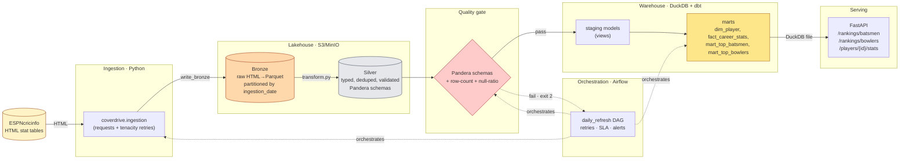
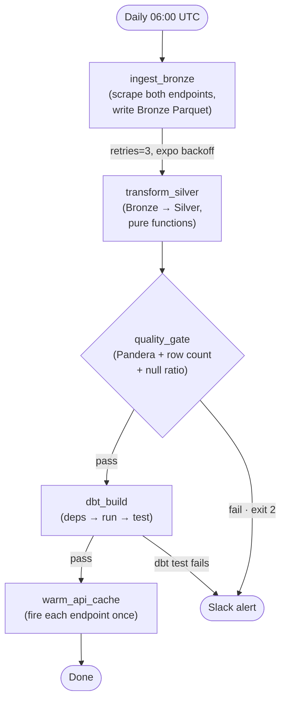

# Coverdrive — Architecture

This document is the **system-design view** of Coverdrive. For the
narrative version (why it exists, how to run it), see the top-level
`README.md`. For the postmortem on the 2022 methodology, see
[`adr-pca-leakage.md`](adr-pca-leakage.md).

---

## 1. What Coverdrive is

Coverdrive is a small, self-contained **data platform** that turns
ESPNcricinfo's career statistics into a queryable warehouse and a thin
HTTP serving layer.

It exists to demonstrate, end-to-end and in production-grade code, the
shape of a modern batch data pipeline: source ingestion, a medallion
lakehouse, in-warehouse transformation with dbt, a quality gate, an
orchestrator, infrastructure-as-code, and an API.

**Non-goals.** This is not a real cricket analytics product, not a
streaming system, not an ML platform, and not a multi-tenant service.
It is single-source, batch, and read-mostly.

---

## 2. Diagram



---

## 3. Layers

### 3.1 Bronze — raw landing

| Property | Value |
|---|---|
| Format | Parquet (Snappy) |
| Path | `s3://{bucket}/bronze/{table}/ingestion_date=YYYY-MM-DD/data.parquet` |
| Partitioning | Hive-style by ingestion date |
| Schema | Whatever the scrape returned — un-renamed, un-typed |
| Idempotency | A re-run with the same `ingestion_date` overwrites that partition; no append-duplication |

Bronze is **the source of truth for what we saw**, not what we believe.
Columns keep their raw names (`HS` with the `*` marker preserved, `Player`
with the country suffix in parentheses, etc.) so that any downstream bug
can be reproduced from this layer alone.

### 3.2 Silver — typed and cleaned

| Property | Value |
|---|---|
| Format | Parquet (Snappy) |
| Path | `s3://{bucket}/silver/{table}/ingestion_date=YYYY-MM-DD/data.parquet` |
| Cleaning | Country split out of `Player`, `*`/`+` suffixes stripped, `Span` parsed to `career_start`/`career_end`, numeric columns coerced |
| Validation | **Pandera** `DataFrameModel` enforced before write — schema, ranges, null ratios, primary key uniqueness |
| Failure mode | Quality gate raises `QualityGateFailure` (exit code 2); pipeline halts before the warehouse build |

The Silver→Bronze relationship is **pure-function**: `transform.py`
contains no I/O, only data manipulation, which makes it trivially
unit-testable from CSV fixtures.

### 3.3 Gold — warehouse marts

| Property | Value |
|---|---|
| Engine | DuckDB (file at `data/warehouse.duckdb`) |
| Transformation | dbt (`dbt-duckdb`) |
| Reads | Silver Parquet via DuckDB's native `read_parquet()` over the S3 layer |
| Models | `staging/*` views, then `marts/*` tables |

Models:

| Model | Materialisation | Purpose |
|---|---|---|
| `stg_batting` | view | typed projection of Silver batting |
| `stg_bowling` | view | typed projection of Silver bowling |
| `dim_player` | table | one row per cricketer; FULL OUTER JOIN of batting & bowling; derives `player_role`; computes both PCA composites |
| `fact_career_stats` | table | long-format: one row per (player, discipline, stat_name) |
| `mart_top_batsmen` | table | eligibility floor (matches ≥ 20); ranked by PCA composite |
| `mart_top_bowlers` | table | eligibility floor (wickets ≥ 10); ranked by PCA composite |

DuckDB was chosen over Postgres or Snowflake for portfolio reasons: it
runs in-process, has no infrastructure cost, reads Parquet on S3
natively, and ships a dbt adapter. For a real production deployment
the same dbt project compiles against Snowflake/BigQuery/Postgres with
a profile change.

### 3.4 Serving — FastAPI

Three read-only endpoints over the warehouse:

- `GET /api/v1/rankings/batsmen` — paginated top-N from `mart_top_batsmen`
- `GET /api/v1/rankings/bowlers` — paginated top-N from `mart_top_bowlers`
- `GET /api/v1/players/{player}/stats` — joined view from `dim_player`

Plus `/healthz` (liveness) and `/readyz` (warehouse-reachability check
— actually opens the DuckDB file and runs `SELECT 1`).

DuckDB is opened **read-only** per-request via a context manager. There
is no connection pool — DuckDB doesn't need one in this access pattern.

---

## 4. Components

| Component | File | Responsibility |
|---|---|---|
| Config | `conf/pipeline.yaml`, `src/coverdrive/utils.py::PipelineConfig` | YAML parsed and validated by Pydantic; env-var overrides via `Settings` |
| Logging | `src/coverdrive/utils.py::build_logger` | structlog → JSON in prod, key-value in dev |
| Retries | `src/coverdrive/utils.py::with_retry` | tenacity factory; consumed by ingestion only; bounded by `max_attempts` × `max_wait_seconds` |
| Ingestion | `src/coverdrive/ingestion.py` | HTTP fetch → BS4 parse → Parquet write; fixtures mode for CI |
| Transform | `src/coverdrive/transform.py` | Pure-function Bronze→Silver; no I/O |
| Quality | `src/coverdrive/quality.py` | Pandera schemas + row-count + null-ratio gates; raises `QualityGateFailure` |
| Warehouse | `dbt/` | dbt project; `compute_pca.sql` macro is the analytics-engineering centrepiece |
| Serving | `src/coverdrive/api.py` | FastAPI app; request logging middleware; DuckDB exception handler |
| Orchestration | `airflow/dags/daily_refresh.py` | TaskFlow DAG; retries; SLAs; failure callbacks |
| Tests | `tests/` | pytest with moto for S3; fixtures under `tests/fixtures/` |
| CI | `.github/workflows/ci.yml` | ruff + mypy + pytest + dbt parse |
| IaC | `infra/terraform/` | AWS: VPC, S3, RDS, ECR, IAM, CloudWatch |

---

## 5. Data flow — the DAG



Key DAG decisions:

- **`quality_gate` has `retries=0`.** A schema violation isn't a flake —
  retrying won't fix bad data. It fails fast and pages.
- **`dbt test` runs inside `dbt build`** so model-level tests
  (`accepted_range`, `unique`, `not_null`) gate the marts.
- **SLA = 6 hours, timeout = 1 hour per task.** SLA miss triggers the
  `sla_miss_callback`; timeout kills the task. Different alerts, different
  meanings.
- **Failure callback posts to Slack** with task name, exception, and a
  link to the Airflow task log.

---

## 6. Operational concerns

### Idempotency

Every layer is idempotent within an `ingestion_date`:

- **Bronze writes** overwrite the date-partitioned file.
- **Silver writes** overwrite the same.
- **dbt models** are either `view` (free) or `table` (truncate-and-replace).
- **API responses** are pure functions of warehouse state.

Re-running the DAG for yesterday is safe. Re-running for today after a
partial failure is safe.

### Observability

| Layer | Mechanism |
|---|---|
| Application logs | structlog → stdout → CloudWatch (in AWS) / `docker logs` (locally) |
| Metrics | `prometheus-client` exposes `/metrics` on the API (counters: request count, quality_gate_failures_total) |
| Lineage | `dbt docs generate && dbt docs serve` produces an interactive DAG |
| Audit | S3 server access logs to a separate bucket (90d retention) |

### Failure semantics

| Failure | Behaviour |
|---|---|
| HTTP 5xx from ESPN | tenacity retry, exponential backoff, max 5 attempts |
| HTTP 4xx from ESPN | no retry, immediate task failure |
| Pandera schema violation | `QualityGateFailure`, exit code 2, Slack alert, no retry |
| dbt test failure | `dbt build` exits non-zero, Slack alert |
| API DuckDB error | logged with `exc_info`, returns 500 with safe message |

### Secrets

- Local: `.env` (gitignored), shape documented in `.env.example`.
- AWS: `TF_VAR_db_password` injected via SSM Parameter Store.
- CI: GitHub Actions secrets, never echoed.

---

## 7. Trade-offs

| Decision | Rationale | Cost |
|---|---|---|
| DuckDB over Snowflake | Free, no infra, ships dbt adapter, reads Parquet natively | Single-process; doesn't demonstrate distributed query engines |
| Airflow standalone over MWAA | Free; runs in `docker-compose` | Doesn't exercise multi-worker scheduling |
| Pandera over Great Expectations | Lighter; integrates with Pandas types directly; no separate suite/checkpoint plumbing | Smaller ecosystem of expectations |
| Batch, no streaming | Source is a daily-refresh stat table; nothing to stream | No Kafka/Flink story |
| One DAG | Single source, single cadence; multiple DAGs would be ceremony | No story on cross-DAG dependencies (`ExternalTaskSensor`, datasets) |
| PCA loadings fixed at 2022 values | Stable rankings across runs | Loadings reflect 2022 player distribution; mitigated by annual recomputation policy (ADR-001) |

---

## 8. Future work

Ordered by realistic value vs. effort:

1. **dbt snapshots on `dim_player`** to track stat changes over time —
   would turn the warehouse from a refresh-and-replace model into a
   Type-2 SCD without much code.

2. **Switch source to CricSheet for per-innings data.** This unlocks
   the credible supervised problem (next-season forecasting) discussed
   in ADR-001 § "Alternatives considered". It is a substantial increase
   in scope — JSON ingestion, ~150k innings, batting partnership graph
   — but it is the right next move if the ML story matters.

3. **Multi-format coverage.** Currently ODI only. Adding Test and T20I
   is a `for fmt in [1, 2, 3]:` loop in `ingestion.py` and three more
   dbt sources. The story it tells is parameterised ingestion.

4. **API write path.** Currently read-only. A `POST /players/{id}/notes`
   for analyst annotations would justify the RDS layer for app state
   (currently RDS exists only for Airflow metadata).

5. **Data contract with the producer.** ESPN isn't a partner, so this
   is hypothetical — but if it were, schema changes in their HTML would
   need to be caught by a contract check, not just by the Pandera gate.

6. **Run on actual AWS.** The Terraform applies cleanly; the missing
   piece is ECS Task Definition + Service for Airflow itself, deliberately
   scoped out (see `infra/terraform/README.md` § "What's not deployed").

---

## 9. Repository map

```
coverdrive/
├── README.md                   # narrative entry point
├── Makefile                    # `make demo` is the one-liner
├── docker-compose.yml          # MinIO, Postgres (Airflow metadata), Airflow
├── pyproject.toml              # strict ruff/mypy config
├── .pre-commit-config.yaml
├── .github/workflows/ci.yml
├── conf/pipeline.yaml          # all parameters, Pydantic-validated
├── src/coverdrive/
│   ├── utils.py                # config, logging, retries, S3 client
│   ├── ingestion.py            # ESPN → Bronze
│   ├── transform.py            # Bronze → Silver (pure functions)
│   ├── quality.py              # Pandera gates
│   └── api.py                  # FastAPI serving layer
├── dbt/
│   ├── dbt_project.yml
│   ├── profiles.yml            # dev (DuckDB) + ci (Postgres) targets
│   ├── macros/compute_pca.sql  # the analytics-engineering centrepiece
│   └── models/
│       ├── sources.yml         # Silver Parquet declared as external sources
│       ├── schema.yml          # column tests
│       ├── staging/{stg_batting,stg_bowling}.sql
│       └── marts/{dim_player,fact_career_stats,mart_top_batsmen,mart_top_bowlers}.sql
├── airflow/dags/daily_refresh.py
├── tests/                      # pytest + moto + fixtures
├── infra/terraform/            # AWS module
└── docs/
    ├── ARCHITECTURE.md         # ← you are here
    └── adr-pca-leakage.md      # the postmortem
```
